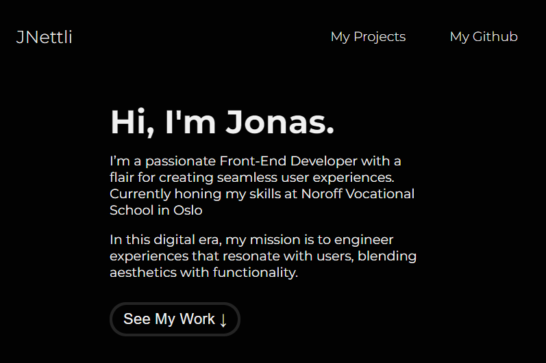

# JNettli's Portfolio

Welcome to the repository for my personal portfolio website. This site showcases my work, skills, and projects I've been involved in.

## Introduction

Hi, I'm Jonas Nettli, a Front-End Developer based in Heggedal, Norway. I have a passion for Front-End Development and a knack for blending aesthetics with functionality! 
This portfolio is a reflection of my professional journey and the work that I'm proud of.

## Screenshot

  

## Features

- **Projects**: A showcase of my latest and most significant projects. 
- **Skills**: A rundown of the technical and soft skills I bring to the table. 
- **Contact**: How to get in touch with me for collaborations or opportunities. Click the email icon at the bottom of the page!

## Technologies Used

  

## License
This project is licensed under the MIT License
